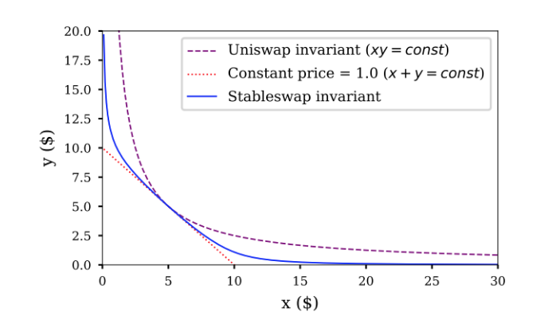

# Algorithm

## Overview

Stable asset is built on top of Curve's stable swap algorithm shown below.

.png>)

The stable swap curve is a combination of Uniswap's constant product and constant sum curves.

When the pool asset prices are closed, the stable swap curve is closed to constant sum and has no slippage. When the token price of any asset shift away, it's becoming closer to constant product. The further the prices shift aways from each other, the more slippage it introduces. This ensures that the pool can always provide sufficient liquidity even at extreme prices.

## Parameters

Curve's Stable Swap invariant has two parameters, A and D.

### Parameter A

A controls the "wideness" of the curve. A large A makes the curve closer to constant sum while a small A makes the curve closer to constant product.&#x20;

A is a parameter that can be adjusted to liquidity available in the pool. When asset prices are close to each other, we can set a larger A so that there is sufficient liquidity near the equal prices. When asset prices shifts away, we can set a smaller A so that there is sufficient liquidity at the discount price range.

### Parameter D

D represents the total number of assets in the basket in the basket when their prices are all equal. It's not a parameter which can be set to adjust the curve behavior; instead, it represents the intrinsic value of the whole basket:

* D is the total number of tokens in the basket when all underlying assets are equal. Since they are of the same peg, D can be seen as basket equilibrium over a long time;
* D is the smallest amount of tokens in the basket when no tokens are added/removed. When the token prices shift, there are more tokens in the basket;
* D is constant when swapping between any token happens. This is why stable swap algorithm can be used as a synthetic asset protocol: arbitrager can help to rebalance the basket according the latest market prices, but the intrinsic value of the basket remains constant.&#x20;

## Implementation

Based on the Stable Swap invariant, the stable asset is backed by a stable swap pool of assets. D, which represents the intrinsic value of the pool, represents the total supply of the stable asset.

### Mint

Any users can mint stable asset with any underlying assets. D is increased when tokens are added to the pool. The increased amount of D is the minted amount of stable asset to the user.

### Redeem

User can redeem stable asset to any of the underlying assets. The decrease in D is the amount of stable asset to burn. The underlying assets to release can be computed with the decreased D value.

### Swap

Swap does not change D of the basket so that the stable asset total supply is unchanged.  However, the swap is also a critical part of the stable asset:

* Arbitragers help rebalance the basket when asset prices changed so that the pool composition can change without admin operations;
* Unlike other synthetic asset protocols where the underlying assets sit idle, the stable asset protocol enhances the capital efficiency by serving the underlying assets as a swap. Swap fee will be minted as stable asset as income to the pool
